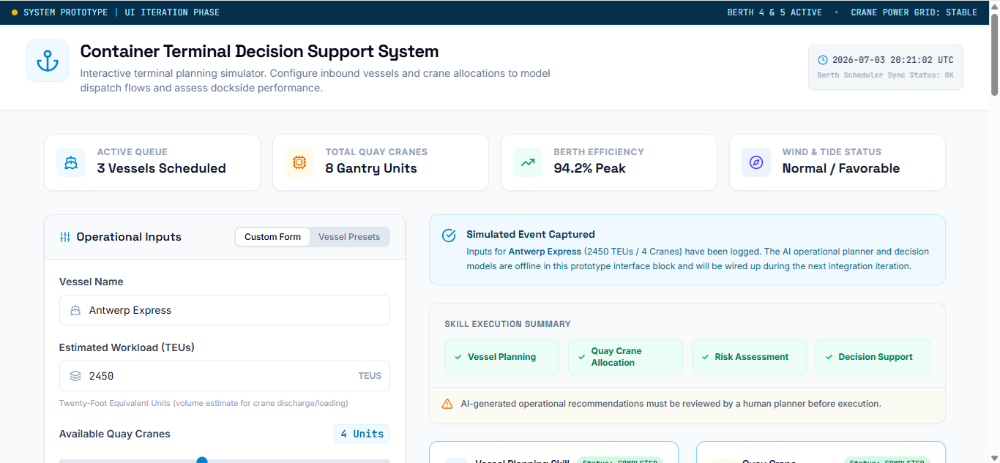

# 🚢 Container Terminal Decision Support System

> An AI-powered operational decision support prototype for container terminal planning, demonstrating modern AI Agent concepts including Skill-Based Architecture, Human-in-the-Loop, Explainability, Responsible AI, and Decision Transparency.

---

# Overview

The **Container Terminal Decision Support System** is an AI-powered prototype developed as the Capstone project for Google's **5-Day AI Agents: Intensive Vibe Coding Course**.

The project demonstrates how modern AI engineering principles can support operational planning by transforming terminal operational inputs into structured decision-support recommendations through a modular, human-centred dashboard.

The prototype was developed incrementally using a **Spec-Driven Development (SDD)** methodology and documents the complete software engineering lifecycle—from requirements analysis to implementation, evaluation, and project documentation.

---

## Dashboard Preview



---

# Key Features

The current prototype includes:

- 🚢 Vessel Planning
- ⚓ Quay Crane Allocation
- ⚠️ Risk Assessment
- 📊 Decision Support
- 🧩 Skill-Based Architecture
- 👤 Human-in-the-Loop (HITL)
- 🔍 Decision Transparency
- 💡 Explainability
- 🛡️ Operational Security
- 🤝 Responsible AI Checklist
- 📈 System Evaluation Dashboard
- 📝 Operational Input Form
- 📱 Responsive User Interface
- ⚙️ Deterministic Operational Logic

---

# Project Status

| Component | Status |
|-----------|:------:|
| Software Requirements Specification (SRS) | ✅ |
| Software Architecture | ✅ |
| Requirements Traceability Matrix (RTM) | ✅ |
| Iteration 1 – Core Application | ✅ |
| Iteration 2 – Operational Decision Support | ✅ |
| Iteration 3 – Skill-Based Architecture | ✅ |
| Iteration 4 – Human-in-the-Loop & Decision Transparency | ✅ |
| Iteration 5 – Responsible AI & Production Readiness | ✅ |

**Overall Status:** ✅ **Capstone Prototype v1.0 Completed**

---

# Technology Stack

- Google AI Studio
- Gemini
- React
- TypeScript
- Vite
- Git
- GitHub

---

# Development Methodology

This project follows an incremental **Spec-Driven Development (SDD)** approach.

Each iteration followed the same engineering workflow:

1. Define Requirements
2. Design AI Studio Prompt
3. Generate Prototype
4. Validate Functionality
5. Capture Screenshots
6. Export Source Code
7. Update Documentation
8. Commit & Push to GitHub

---

# Repository Structure

```text
docs/
│
├── SRS.md
├── architecture.md
├── roadmap.md
├── iterations.md
├── evaluation.md
└── lessons-learned.md
prompts/
├── iteration-1.md
├── iteration-2.md
├── iteration-3.md
├── iteration-4.md
└── iteration-5.md

screenshots/

src/
assets/

README.md
```

---

# Design Principles

The prototype is built around the following software engineering principles:

- Spec-Driven Development
- Modular Architecture
- Skill-Based Design
- Human-Centred AI
- Human-in-the-Loop
- Explainability
- Decision Transparency
- Responsible AI
- Maintainability
- Incremental Delivery
- Reliability

---

# Repository Contents

This repository contains:

- Complete Source Code
- Software Requirements Specification (SRS)
- Software Architecture
- Requirements Traceability Matrix (RTM)
- Development Roadmap
- Project Evaluation Report
- Lessons Learned
- Iteration Reports
- Product Screenshots
- AI Studio Prompt History

---

# Learning Outcomes

This Capstone project demonstrates practical implementation of:

- AI-powered Decision Support Systems
- Agent-inspired Skill-Based Architecture
- Human-in-the-Loop workflows
- Explainable AI concepts
- Responsible AI principles
- Operational governance
- Incremental AI-assisted software development

---

# Course

Developed as the Capstone project for:

**Google — 5-Day AI Agents: Intensive Vibe Coding Course**

---

# Author

**Kaveh Hakimi Firooz**

AI Engineer | Product Manager | MSc Data Science & AI

---

# License

This repository is provided for educational, research, and portfolio purposes.