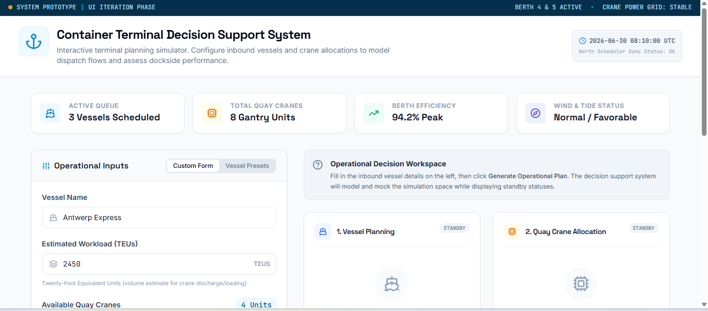

# Iteration 1 – Core Application

## Objective

Build the initial structure of the Container Terminal Decision Support System.

This iteration focuses on establishing the application layout and user interface without implementing AI reasoning or operational planning logic.

---

## Scope

Included:

- Modern dashboard
- Application title
- Project description
- Operational input form
- Generate Operational Plan button
- Four placeholder skill panels
- Responsive layout
- Initial deployment

Excluded:

- AI analysis
- Operational recommendations
- Skill implementation
- Human-in-the-Loop
- Security features

---

## AI Studio Prompt

Build the initial version of a web application called:

Container Terminal Decision Support System

This is an AI-powered operational decision support prototype for container terminal planning.

For this iteration, DO NOT implement AI analysis or operational logic.

Only create the application structure and user interface.

Requirements:

• Create a modern professional dashboard.

• Add a title:
Container Terminal Decision Support System

• Add a short project description.

• Create an input panel containing:

- Vessel Name
- Estimated Workload
- Available Quay Cranes
- Operational Notes

• Add a button:

Generate Operational Plan

The button does not need to perform any AI reasoning yet.

Instead, display placeholder result panels.

Create four output cards:

1. Vessel Planning

Display:
"Waiting for analysis..."

2. Quay Crane Allocation

Display:
"Waiting for analysis..."

3. Risk Assessment

Display:
"Waiting for analysis..."

4. Decision Support

Display:
"Waiting for analysis..."

Design requirements:

- Modern responsive layout
- Professional colours
- Clean typography
- Card-based interface
- Container terminal themed
- No backend implementation
- No AI implementation
- No mock recommendations

Only build the UI structure that will be extended in later iterations.

---

## Deliverables

- Initial web application
- Dashboard
- Input form
- Placeholder skill cards
- Publishable prototype

---

## Validation

- Application builds successfully.
- Application deploys successfully.
- User interface loads correctly.
- Generate button is displayed.
- All four skill panels are visible.

---

## Status

✅ Completed

---

## Notes

The application was successfully generated and deployed using Google AI Studio.

This iteration establishes the software foundation for implementing AI-powered operational skills in subsequent iterations.

## Screenshot

