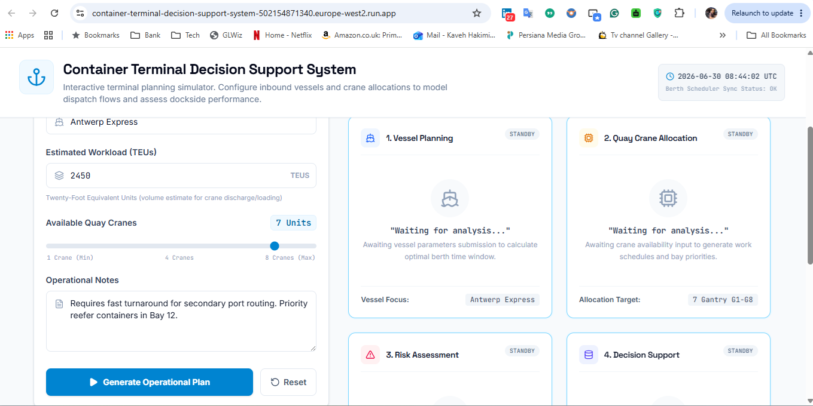
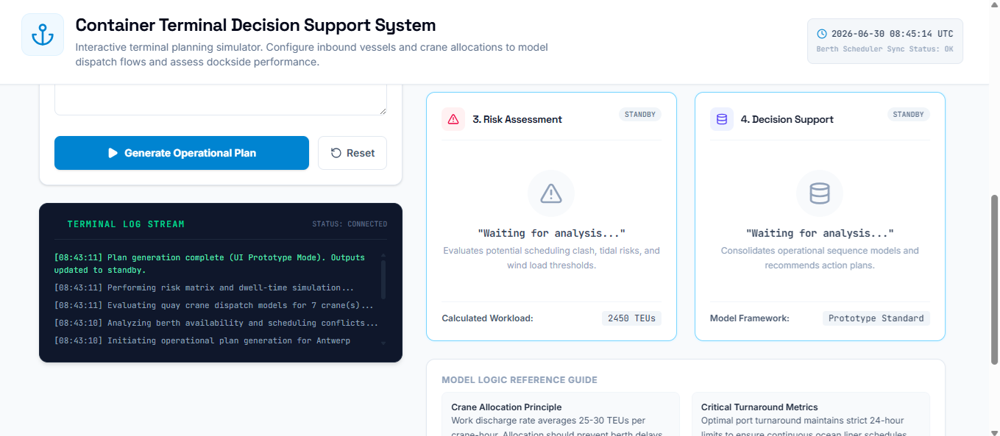

# Iteration 2 – Initial Operational Skill Integration

## Objective

Introduce the first operational AI capability into the Container Terminal Decision Support System while preserving the existing application structure and user interface.

This iteration focuses on implementing the initial Vessel Planning functionality and preparing the application for future skill-based enhancements.

---

## Scope

### Included

- Initial Vessel Planning Skill
- Basic operational analysis workflow
- Button interaction refinement
- Improved dashboard presentation
- Terminal Log Stream
- Initial operational simulation interface

### Excluded

- Quay Crane Allocation logic
- Risk Assessment logic
- Decision Support logic
- Human-in-the-Loop workflow
- Security features

---

# AI Studio Prompt 1

```text
Enhance the existing Container Terminal Decision Support System.

This is Iteration 2A.

Only implement the Vessel Planning Skill.

Do not change the overall layout, project title, input form, or existing dashboard structure.

Use the existing input fields:

- Vessel Name
- Estimated Workload
- Available Quay Cranes
- Operational Notes

When the user clicks "Generate Operational Plan", update only the Vessel Planning card.

The Vessel Planning Skill should generate:

1. Vessel workload assessment
2. Estimated operation duration
3. Planning considerations
4. Reason for the analysis

Keep the other cards unchanged and still display:
"Waiting for analysis..."

Do not implement:

- Quay Crane Allocation
- Risk Assessment
- Decision Support
- Human-in-the-Loop
- Security features

Design requirements:

- Keep the UI clean and professional
- Display the Vessel Planning output inside the existing Vessel Planning card
- Use concise operational language
- Make the output easy for a terminal planner to understand
- Keep the implementation lightweight and suitable for a prototype
```

---

## Result

The application was successfully regenerated and deployed.

The overall dashboard and user interface remained stable; however, the Vessel Planning card continued displaying the placeholder message instead of dynamically generated operational analysis.

Although the requested operational logic was not fully implemented, the deployment completed successfully without errors.

---

# AI Studio Prompt 2 (Refinement)

```text
Fix the Generate Operational Plan button.

When the user clicks the button, the Vessel Planning card must update from "Waiting for analysis..." to a generated vessel planning analysis.

Use the existing input fields:

- Vessel Name
- Estimated Workload
- Available Quay Cranes
- Operational Notes

The Vessel Planning card must display:

1. Vessel workload assessment
2. Estimated operation duration
3. Planning considerations
4. Reason for the analysis

Keep all other cards unchanged and displaying "Waiting for analysis...".

Do not redesign the UI.

Do not add new features.

Only fix the button interaction and Vessel Planning card output.
```

---

## Result

The refined prompt was successfully generated and deployed.

Although the placeholder text remained unchanged, the application interface was noticeably enhanced.

The following improvements were automatically introduced by Google AI Studio:

- Terminal Log Stream panel
- Improved operational dashboard layout
- Better visual hierarchy
- Enhanced operational status indicators
- More realistic container terminal simulation interface
- Improved responsiveness and professional appearance

These enhancements provide a stronger foundation for implementing operational logic in the following iterations.

---

# Deliverables

- Enhanced operational dashboard
- Initial operational simulation interface
- Terminal Log Stream
- Improved Generate Operational Plan workflow
- Stable deployment
- Published prototype

---

# Validation

| Item | Status |
|------|--------|
| Application builds successfully | ✅ |
| Application deploys successfully | ✅ |
| Application publishes successfully | ✅ |
| Dashboard remains stable | ✅ |
| Terminal Log Stream added | ✅ |
| Generate button functional | ✅ |
| Vessel Planning logic fully implemented | ⚠️ Partial |

---

# Lessons Learned

This iteration demonstrated an important characteristic of AI-assisted application development.

Rather than immediately implementing the requested operational logic, Google AI Studio prioritised improving the overall application interface and user experience.

Future prompts should specify observable functional behaviour more explicitly instead of requesting abstract capabilities such as "implement a skill."

This lesson will guide the prompt engineering strategy for the remaining iterations.

---

# Screenshots

## Initial Iteration 2 Dashboard



---

## Enhanced Operational Dashboard



---

# Status

✅ Completed

---

# Next Iteration

Iteration 3 will focus on implementing observable operational behaviour by replacing placeholder outputs with dynamically generated analysis for each operational skill.