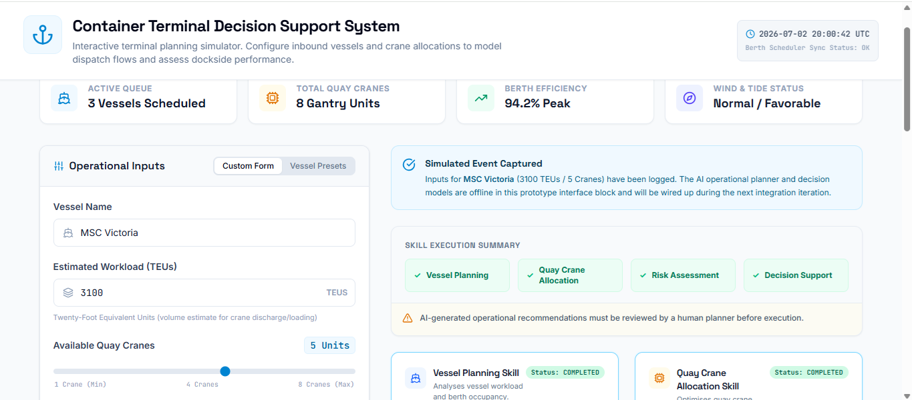
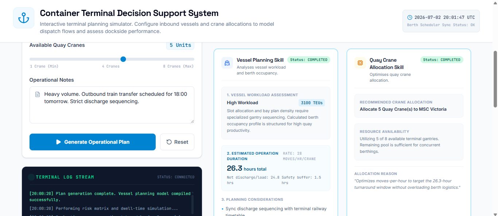
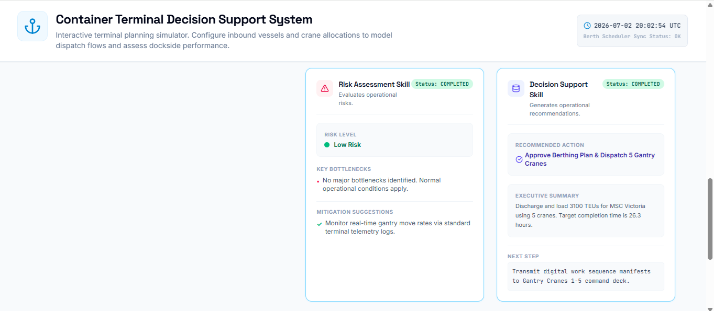

# Iteration 3 – Skill-Based Architecture

## Objective

Transform the operational dashboard into a Skill-Based Decision Support System by introducing explicit operational skills, execution status tracking, and human-centred AI guidance.

This iteration focuses on improving transparency and modularity without changing the existing operational logic.

---

## Scope

### Included

- Skill-Based Architecture
- Skill labels
- Skill descriptions
- Skill execution status
- Skill Execution Summary panel
- Human review reminder
- Dashboard enhancements

### Excluded

- Human-in-the-Loop controls
- Security features
- Evaluation metrics
- Explainability
- External AI services

---

## AI Studio Prompt

Enhance the existing Container Terminal Decision Support System.

This is Iteration 3 of the Capstone project.

Do not redesign the interface.

Do not change the existing operational logic.

Do not modify the deterministic calculations.

Your task is to improve the application by introducing a clear Skill-Based Architecture.

Implement the following enhancements:

1. Label each operational card as a Skill.

Display:

- Vessel Planning Skill
- Quay Crane Allocation Skill
- Risk Assessment Skill
- Decision Support Skill

2. Update the Skill Status.

Before Generate:

Status: STANDBY

After successful generation:

Status: COMPLETED

3. Add a one-line description below each Skill title.

4. Add a Skill Execution Summary panel above the four cards.

5. Add an informational banner:

"AI-generated operational recommendations must be reviewed by a human planner before execution."

Do not implement Human-in-the-Loop controls yet.

Maintain the existing dashboard layout and deterministic operational logic.

---

## Deliverables

- Skill-Based Architecture
- Skill Execution Summary
- Operational Skill Labels
- Skill Status Indicators
- Human Review Banner

---

## Validation

- Skill labels displayed correctly.
- Skill descriptions displayed.
- Skill status changes after plan generation.
- Skill Execution Summary updates correctly.
- Human review reminder is visible.
- Existing operational logic remains functional.

---

## Status

✅ Completed

---

## Notes

This iteration introduces a modular Skill-Based Architecture inspired by modern AI Agent systems.

Rather than changing the operational logic, the focus was placed on improving transparency, modularity, and user understanding of the decision-making workflow.

These enhancements prepare the system for the Human-in-the-Loop workflow planned for the next iteration.

---

## Next Iteration

Iteration 4 will introduce Human-in-the-Loop controls allowing operators to:

- Accept the operational plan
- Request re-analysis
- Modify operational inputs before execution

---

## Screenshots

### Skill Execution Summary

### Operational Skills

### Decision Support Skills

