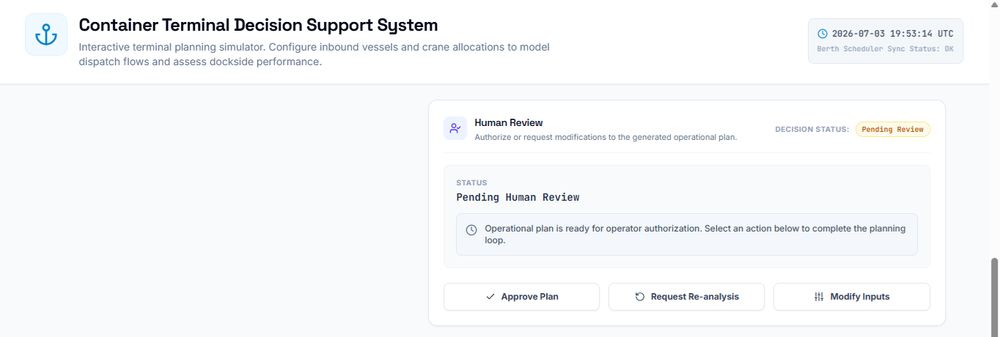
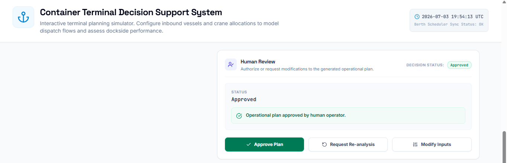
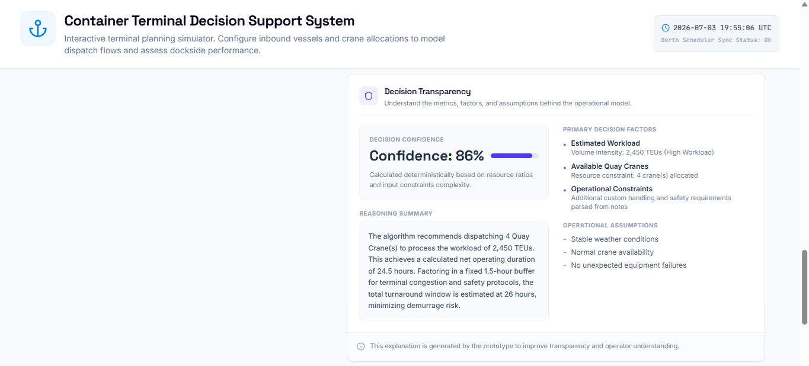

# Iteration 4 – Human-in-the-Loop & Decision Transparency

## Objective

Enhance the Container Terminal Decision Support System by introducing Human-in-the-Loop (HITL) interaction and decision transparency features.

This iteration focuses on increasing user trust, operational accountability, and explainability while preserving the existing deterministic operational logic.

---

## Scope

### Included

- Human Review panel
- Decision Status indicator
- Approve Plan action
- Request Re-analysis action
- Modify Inputs action
- Decision Transparency panel
- Decision Confidence
- Primary Decision Factors
- Reasoning Summary
- Operational Assumptions
- Transparency notice

### Excluded

- External AI services
- Backend implementation
- Dynamic confidence estimation
- Explainable AI models
- Security monitoring

---

# AI Studio Prompt – Part A (Human-in-the-Loop)

Enhance the existing Container Terminal Decision Support System.

This is Iteration 4A of the Capstone project.

Do not redesign the dashboard.

Do not modify the existing operational logic.

Do not change the Skill-Based Architecture.

Your task is to introduce a Human-in-the-Loop (HITL) workflow.

Implement the following features:

1. Add a new panel below the Decision Support Skill titled:

Human Review

2. Add three action buttons:

- Approve Plan
- Request Re-analysis
- Modify Inputs

3. Workflow

Before the operational plan is generated:

Status:
Waiting for operational analysis.

After Generate Operational Plan:

Status:
Pending Human Review

If the user clicks Approve Plan:

Status changes to:

Approved

Display:

Operational plan approved by human operator.

If the user clicks Request Re-analysis:

Status changes to:

Re-analysis Requested

Display:

The operator requested a new operational assessment.

No recalculation is required.

If the user clicks Modify Inputs:

Scroll the page to the Operational Inputs section.

Display:

Please modify the operational parameters and generate a new plan.

4. Add a Decision Status badge.

Possible values:

- Pending Review
- Approved
- Re-analysis Requested

5. Preserve all existing operational logic.

6. Preserve all existing Skills.

7. Preserve the existing dashboard design.

Do not implement backend services.

Do not call external AI models.

Keep the implementation deterministic and lightweight.

---

# AI Studio Prompt – Part B (Decision Transparency)

Enhance the existing Container Terminal Decision Support System.

This is Iteration 4B of the Capstone project.

Do not redesign the interface.

Do not modify the existing operational logic.

Do not change the Human-in-the-Loop workflow.

Your task is to improve transparency and trust by adding explainability features.

Implement the following enhancements:

1. Add a new panel below the Human Review section titled:

Decision Transparency

2. Display the following fields:

- Decision Confidence
- Primary Decision Factors
- Reasoning Summary
- Operational Assumptions

Display a confidence score between 80% and 95%.

Generate all explanations deterministically from the operational inputs.

3. Add an informational note:

"This explanation is generated by the prototype to improve transparency and operator understanding."

Do not call external AI services.

Do not modify the operational recommendation logic.

Maintain the existing dashboard layout.

---

## Deliverables

- Human Review workflow
- Human-in-the-Loop controls
- Decision Status indicator
- Decision Transparency panel
- Decision Confidence
- Primary Decision Factors
- Reasoning Summary
- Operational Assumptions
- Transparency notice

---

## Validation

- Human Review panel is displayed.
- Decision Status changes correctly.
- Approve Plan functions correctly.
- Request Re-analysis functions correctly.
- Modify Inputs returns the user to the input form.
- Decision Transparency panel is displayed.
- Decision Confidence is shown.
- Primary Decision Factors are listed.
- Reasoning Summary is generated.
- Operational Assumptions are displayed.
- Existing operational logic remains functional.

---

## Status

✅ Completed

---

## Notes

This iteration significantly improves the trustworthiness of the prototype by introducing Human-in-the-Loop interaction and decision transparency.

Rather than relying solely on automated recommendations, the system now explicitly requires human review before operational approval.

In addition, deterministic explainability components—including confidence estimation, reasoning summaries, decision factors, and operational assumptions—provide greater transparency and help users understand how recommendations are produced.

These enhancements align the prototype with modern Human-Centred AI and Trustworthy AI principles while maintaining a lightweight architecture suitable for a Capstone project.

---

## Next Iteration

Iteration 5 will focus on final project refinement, including:

- Security considerations
- Responsible AI practices
- Evaluation metrics
- Final UI polish
- Project documentation
- Production readiness improvements

---

## Screenshots

### Human Review Panel

### Human-in-the-Loop Workflow

### Decision Transparency

