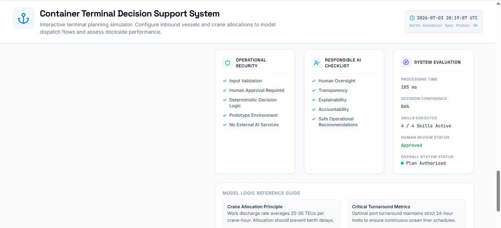
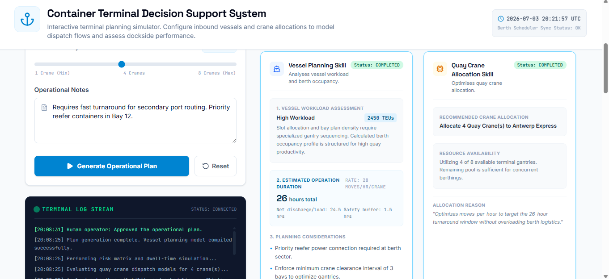

# Iteration 5 – Responsible AI & Production Readiness

## Objective

Strengthen the prototype by introducing operational governance, Responsible AI principles, security considerations, and system evaluation metrics.

The objective of this iteration is to improve transparency, trustworthiness, and production readiness while preserving the existing operational workflow.

---

## Scope

### Included

- Operational Security panel
- Responsible AI Checklist panel
- System Evaluation panel
- Header status bar
- Final UI refinement
- Governance information
- Prototype readiness improvements

### Excluded

- Backend implementation
- External AI/LLM integration
- Database connectivity
- Authentication and authorisation
- Real-time terminal data
- Cloud monitoring

---

# AI Studio Prompt

Enhance the existing Container Terminal Decision Support System.

This is Iteration 5 (Final Iteration) of the Capstone project.

Do not redesign the dashboard.

Do not modify any existing operational logic.

Do not change the Human-in-the-Loop workflow.

Do not change the Decision Transparency panel.

Your task is to improve production readiness by adding operational governance and evaluation information.

Implement the following enhancements.

1. Add a new panel:

Operational Security

Display:

- Input Validation
- Human Approval Required
- Deterministic Decision Logic
- Prototype Environment
- No External AI Services

2. Add a new panel:

Responsible AI Checklist

Display:

- Human Oversight
- Transparency
- Explainability
- Accountability
- Safe Operational Recommendations

3. Add a new panel:

System Evaluation

Display:

- Processing Time
- Decision Confidence
- Skills Executed
- Human Review Status
- Overall System Status

Populate these values deterministically from the current application state.

4. Add a header status bar showing prototype operational context.

Example:

SYSTEM PROTOTYPE | UI ITERATION PHASE

5. Preserve all existing functionality.

Do not redesign the UI.

Do not call external AI services.

Do not implement backend services.

The objective is to produce a polished Capstone prototype ready for demonstration.

---

## Deliverables

- Operational Security panel
- Responsible AI Checklist
- System Evaluation panel
- Production readiness improvements
- Governance information
- Final dashboard refinement

---

## Validation

- Operational Security panel is displayed correctly.
- Responsible AI Checklist is visible.
- System Evaluation metrics are displayed.
- Header status bar is visible.
- Existing operational workflow remains unchanged.
- Human-in-the-Loop workflow still functions correctly.
- Decision Transparency remains functional.
- No existing functionality is broken.

---

## Status

✅ Completed

---

## Notes

This iteration completes the Capstone prototype by introducing governance and Responsible AI concepts without increasing system complexity.

Operational Security, Responsible AI, and System Evaluation improve user trust and demonstrate production-oriented design principles while maintaining a lightweight deterministic implementation.

The application is now suitable for demonstrating modern AI engineering concepts including Human-in-the-Loop, Explainability, Transparency, Operational Governance, and Responsible AI.

---

## Product Screenshots

### Operational Governance Panels

### Final Dashboard Overview

### Operational Results

